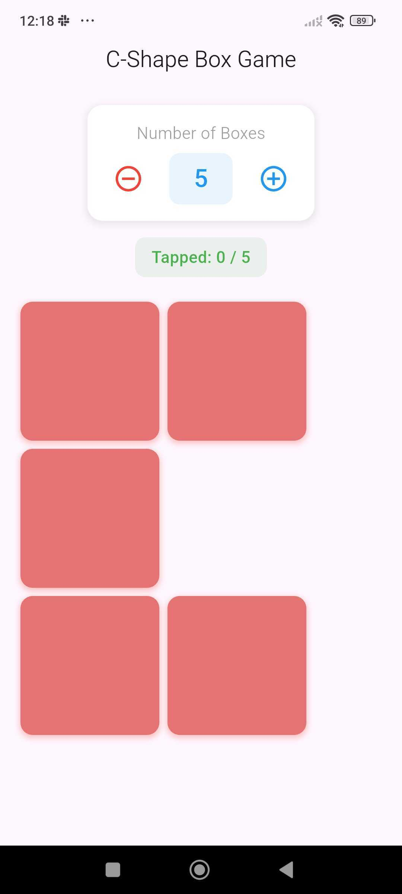
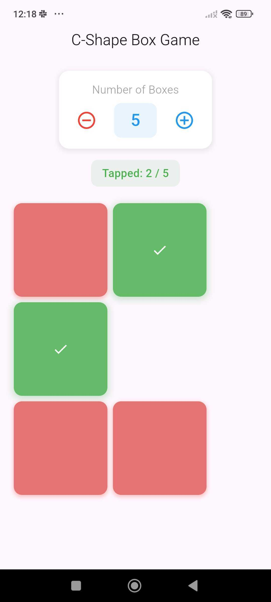
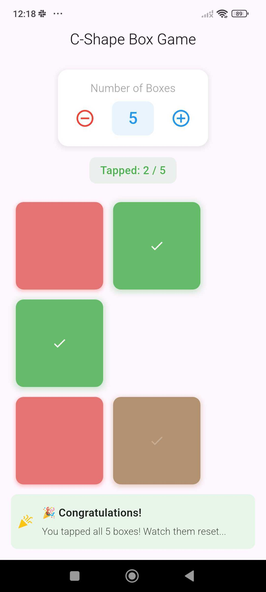

# C-Shape Box Game

An interactive Flutter application that demonstrates state management and animations using GetX. The
app features a dynamic C-shaped layout of boxes that can be tapped and animated, with a counter to
control the number of boxes.

## Flutter Version

- Dart SDK: ^3.6.0
- Flutter Dependencies:
    - get: ^4.6.6 (State Management)
    - cupertino_icons: ^1.0.8

## Setup Instructions

1. Ensure you have Flutter installed and set up on your machine
2. Clone the repository
3. Run `flutter pub get` to install dependencies
4. Run `flutter run` to start the application

## Implementation Details

### Architecture

The project follows a MVC architecture pattern with clear separation of concerns:

- **View Layer** (`view.dart`)
    - Handles UI rendering and user interactions
    - Uses GetX reactive state management for automatic UI updates
    - Implements smooth animations and transitions
    - Contains no business logic, only UI-related code

- **Controller Layer** (`controller.dart`)
    - Manages application state and business logic
    - Handles box state management through BoxState model
    - Controls animations and state transitions
    - Provides computed properties and validation methods

### Key Features

1. **Dynamic C-Shape Layout**
    - Automatically adjusts based on screen size
    - Maintains C-shape formation with variable number of boxes
    - Responsive design that works across different screen sizes

2. **Interactive Box Management**
    - Counter controls (5-25 boxes)
    - Individual box state tracking
    - Animated state transitions
    - Dynamic shadow and color effects

3. **Animations**
    - Smooth color transitions from red to green
    - Scale animations on interaction
    - Checkmark icon fade-in effect
    - Reverse animation sequence on completion

4. **State Management**
    - Reactive state updates using GetX
    - Efficient box state handling
    - Automatic UI updates on state changes
    - Clean separation of UI and business logic

### Controller Features

- Computed properties for UI state
- Validation methods for box count limits
- Animation sequence management
- State preservation during count changes

## Screenshots

Here are some screenshots demonstrating the app's functionality:

  
  
  

